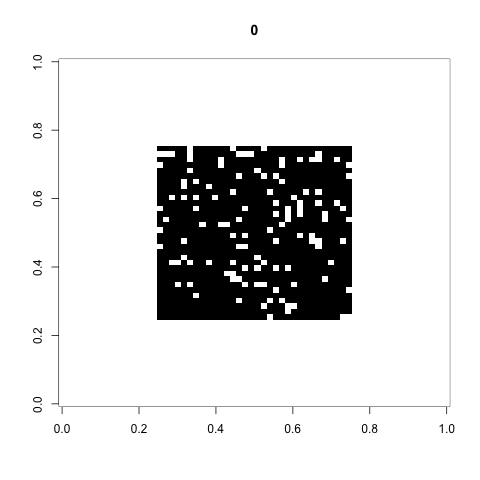

# Transient dynamics in non-equilibrium complex systems


<center>
  
|Gas Mixing Model | Game Of Life |
|-----------------|--------------|
|  | 

<hr>

Source code for simulations and analysis described in Sellis, D. (2018, July 26). Transient dynamics in non-equilibrium complex systems. Retrieved from [osf.io/bkz52](osf.io/bkz52)

## Requirements

### transientDynamics simulator
- a C++ compiler such one of the following:
  - g++ GNU Compiler Collection [https://gcc.gnu.org/](https://gcc.gnu.org/) or
  - clang [https://clang.llvm.org/](https://clang.llvm.org/)

### Analysis of results
- R [https://www.r-project.org/](https://www.r-project.org/)

### Running a simulations

Once all requirements are satisfied compile the source with

```
$> cd src
$> make
```

A file `run` is generated that be used to launch a simulation:

```
./run side model replicates Tmax byS byW byV statisticsFile windowFile vectorFile

where:

side:           int       The side of the world matrix

model           [1,2,3,4] The model to simulate:
                            1:     Gas mixing
                            2:     Game of Life
                            3:     Gradient
                            4:     Uniform

replicates      int       How many simulations to run

Tmax            int       Number of cycles to run

byS             int       Save output file statisticsFile every byS cycles

byW             int       Save output file windowFile every byS cycles

byV             int       Save output file vectorFile every byS cycles

statisticsFile  string    Path and filename for statistics output file. This
                          file contains summary statistics for each cycle

windowFile      string    Path and filename for window output file. This file
                          contains summary statistics for each cycle and coarse
                          graining window size

vectorFile      string    Path and filename for vector output file. This file
                          contains world matrix concatenated to a vector for
                          each cycle
```

### Output file format

#### Statistics output file

The statistics output file is a tab separated file that has information for each cycle (one cycle per row)
with the following columns:

|Name      | Description                    |
|----------|--------------------------------|
|replicate | Number of replicate simulation |
|generation| Cycle number                   |
|Ktl       |                                |
|Kce       |                                |
|Kbr       |                                |
|Htl       |                                |
|Hce       |                                |
|Hbr       |                                |
|Dtl       |                                |
|Dce       |                                |
|Dbr       |                                |

#### Window output file
The window file is a tab delimited file that contains the output for each coarse graining window size

|Name      | Description                    |
|----------|--------------------------------|
|replicate | Number of replicate simulation |
|generation| Cycle number                   |
|window    |                                |
|K         |                                |
|H         |                                |
|S         |                                |

#### Vector output file
The vector output file contains has in each row the cycle number and the world matrix concatenated into a vector (space delimited)
